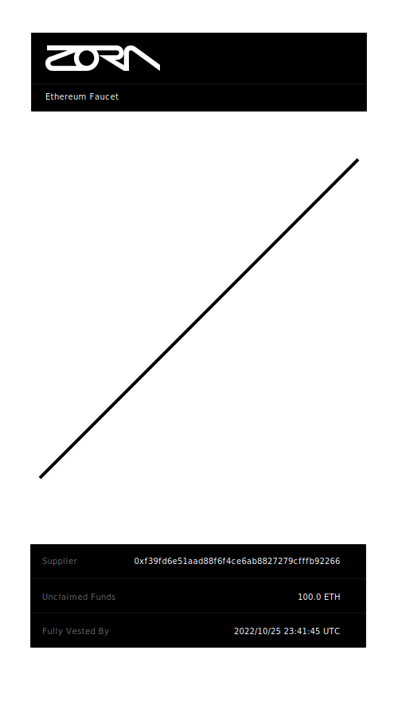
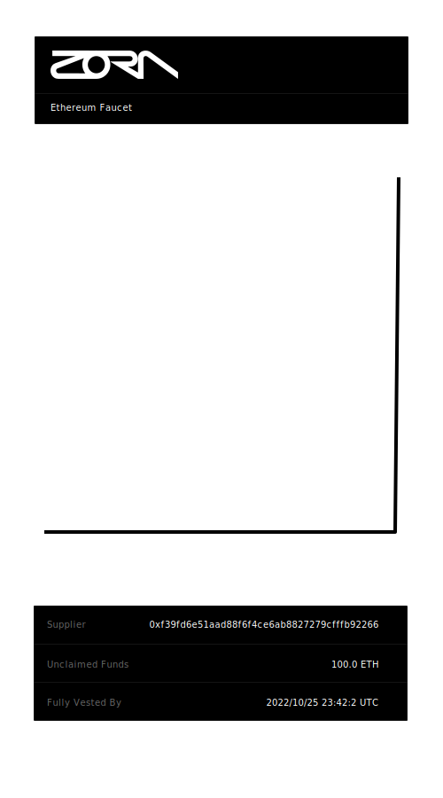

# Faucets


Faucets are vesting NFTs that allow funds to be remitted on a fixed schedule. Faucets can be used for streaming payments, equity vesting, call options, and more. Since they are represented as NFTs, they can also be bought, sold, and traded on open markets.

## Usage

> IMPORTANT: These contracts have not been audited. Use at your own risk.

The Faucet contracts are deployed at the following addresses:

| _Name_                       | _Goerli Address_                             | _Mainnet Address_                            |
|------------------------------|----------------------------------------------|----------------------------------------------|
| FaucetFactory                | `0x8e614c783dcfef3df69154cca157eaf51fc32012` | `0xd6239b155eb29a34b7e277d89f2801c614f41021` |
| LinearStrategy               | `0xfd36c0b2f508e6afb4c1c66e16b45e2a61a73136` | `0xca734042f60dcb45363622571eae8a08e09c4d0e` |
| CliffStrategy                | `0xd7cbd3911074d361ab5cd01fbcf80063d31e6ff3` | `0x8ea04aa8aa5174fe641fde342e740ea167d25fed` |
| DailyStepStrategy            | `0x8e614c783dcfef3df69154cca157eaf51fc32012` | `0x53d83fdd793db21161c4bd663cb7382dafc90626` |
| FaucetMetadataRenderer       | `0x1c32dafad64581af5f9b25f0ebe4d2a32ed6cc46` | `0xcd8fc518f8228f2266c7c53643d7dddac4088ca5` |
| ETHFaucet (implementation)   | `0xd7cbd3911074d361ab5cd01fbcf80063d31e6ff3` | `0x8e5a4cd78c5960285c9f9a2efd9142e9930cad4f` |
| ERC20Faucet (implementation) | `0xfd36c0b2f508e6afb4c1c66e16b45e2a61a73136` | `0xac83e8d852f316eb2dd85e806c1b61b682e32499` |

Most of the common use cases can be found below. 

### Getting a Faucet address

Every deployed faucet maps 1-to-1 with an ERC-20 token (or native ETH). In order to find the faucet that corresponds to a particular token, you can call `faucetForToken` on the `FaucetFactory` contract. This function returns the address that the given token's faucet is deployed at. If the faucet has not been deployed yet, it will be deployed here. If you wish to only retrieve the address without deploying an unused faucet, you can call `faucetForTokenView`.

**Example**

```solidity
// Get the faucet for ETH, deploying it if it hasn't been created yet
(address ethFaucet, bool wasJustDeployed) = FaucetFactory(factoryAddress).faucetForToken(address(0));

// Get the faucet for RAI, deploying it if it hasn't been created yet
(address raiFaucet, bool wasJustDeployed) = IFaucetFactory(factoryAddress).faucetForToken(raiAddress);

// Get the faucet for ETH
address ethFaucet = IFaucetFactory(factoryAddress).faucetForTokenView(address(0));

// Get the faucet for RAI
address raiFaucet = IFaucetFactory(factoryAddress).faucetForTokenView(raiAddress);
```

### Minting a Faucet

To mint a faucet, simply call `mint` with the parameters you'd like in your faucet. These parameters include

| _Name_          | _Type_  | _Description_                                                                                                                 |
|-----------------|---------|-------------------------------------------------------------------------------------------------------------------------------|
| `_to`             | `address` | The address to send this faucet to. The holder of the faucet will be able to claim any available funds.                       |
| `_amt`            | `uint256` | The total amount of tokens that can be claimed in this faucet's lifespan. Once exceeded, this faucet will be discarded.       |
| `_faucetDuration` | `uint256` | The amount of time, in seconds, that this faucet will run for. When the time is up, all funds should be claimable.            |
| `_faucetStrategy` | `address` | The address of the strategy to use for token emissions. See [Faucet Strategies](#faucet-strategies).                          |
| `_canBeRescinded` | `bool`    | Whether or not the creator of this faucet can rescind the faucet, clawing back any unclaimed funds and discarding the faucet. |

**Example**

```solidity
// Send a linearly vesting ETH payment to Alice, vesting over 1 week
uint256 oneWeek = 60 * 60 * 24 * 7; // 60s * 60m * 24h * 7d = 1 week
(address faucetAddress,) = IFaucetFactory(factoryAddress).faucetForToken(address(0)); // Get the faucet address
IFaucet(faucetAddress).mint{value: 1 ether}(address(0), aliceAddress, 1 ether, oneWeek, linearStrategy, true);

// Send a delayed USDC payment to Bob, waiting over 1 day
uint256 oneDay = 60 * 60 * 24; // 60s * 60m * 24h = 1 day
(address faucetAddress,) = IFaucetFactory(factoryAddress).faucetForToken(usdcAddress);
IFaucet(faucetAddress).mint(usdcAddress, bobAddress, 100 ether, oneDay, cliffStrategy, true);
```

### Rescinding a Faucet
If a faucet ever needs to be cancelled, it can safely be rescinded, clawing back any unclaimed funds. To do so, pass the faucet ID and the address to send the remaining funds to.

**Example**

```solidity
// Rescind an ETH payment from Alice, clawing back funds to the supplier's treasury
(address faucetAddress,) = IFaucetFactory(factoryAddress).faucetForToken(address(0)); // Get the faucet address
IFaucet(faucetAddress).rescind(treasuryAddress, tokenID);

// Expedite a UNI payment to Bob, sweeping all remaining funds to their address
(address faucetAddress,) = IFaucetFactory(factoryAddress).faucetForToken(uniAddress); // Get the faucet address
IFaucet(faucetAddress).rescind(bobAddress, tokenID);
```

### Claiming Funds from a Faucet
Holding a faucet allows you to claim any available funds on that faucet.

**Example**

```solidity
// Claim an ETH payment from a faucet
(address faucetAddress,) = IFaucetFactory(factoryAddress).faucetForToken(address(0)); // Get the faucet address
IFaucet(faucetAddress).claim(yourAddress, tokenID);
```

## Faucet Strategies

Every faucet is created with a Faucet Strategy. These strategies define the emission rate of the underlying asset, and their flexibility allows for a number of different use cases. This repo currently has three example strategies available, but any contract implementing `IFaucetStrategy` can be used here. Pull requests to this repo with further strategies and use cases are greatly appreciated.

### Linear Strategy
This strategy vests continuously along a linear curve. Once the provided duration is complete, all tokens should be available to be minted. This strategy type is particularly useful for streaming payments.



### Cliff Strategy
This strategy does not vest until the provided duration has completed. At that point, all underlying tokens can be claimed. This strategy type can be used to represent futures options, or a payment held in escrow.



### Daily Step Strategy
This strategy emits an equal amount of underlying tokens every day until exhausted, when the vesting duration is complete. 


## Acknowledgements

This repo wouldn't have been possible without the prior work of others. particularly [Iain Nash](https://twitter.com/isiain) and [Remco Bloemen](https://twitter.com/recmo).

Iain's work on [Zora's Drop Contracts](https://github.com/ourzora/zora-drops-contracts) was especially helpful with enabling all Faucet metadata to be stored and rendered entirely on-chain.

Remco's writing on [Solidity Mathemagic](https://medium.com/wicketh/mathemagic-full-multiply-27650fec525d) enabled the highly accurate Linear Strategy to be realized.